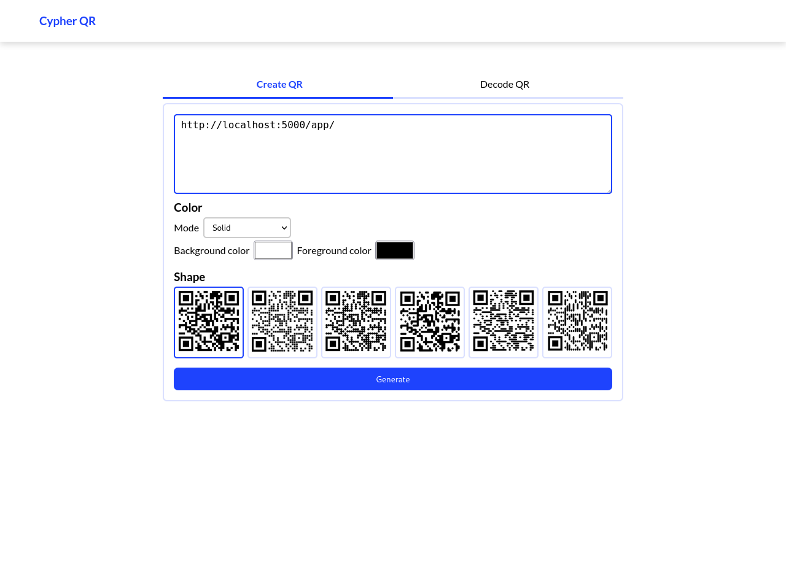
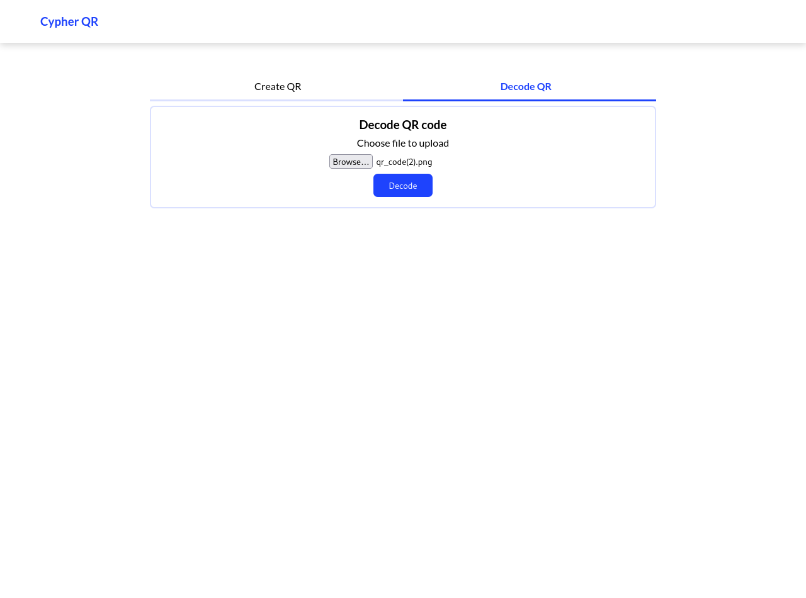

### QR code generator & decoder web app

This is a Flask poject for creating QR codes and also decoding them. No qr code templates are provided for now, also care should be taken when styling the qr code, not all scanners can scan some of the styles provided in this application.


### Demo

[Youtube video link](https://youtu.be/-4Aog7blSkU)

### Screenshots




### Requirements

-   [Python](https://www.python.org/downloads/)
-   [Poetry](https://python-poetry.org/docs/#installation)

### Quickstart

-   Clone project

```bash
git clone https://github.com/lokaimoma/Flask-QR-Code-Web-APP.git
```

-   Install dependencies

```bash
poetry install --no-root
```

-   Add .env file
    You can rename .env_example to .env, and put in the right values for each entry.
    You can leave `FLASK_APP` as it is.

-   Create dabase tables
    Whiles in the project root execute the command below to create the database tables.
    ```bash
    poetry run flask db upgrade head
    ```
-   Run

```bash
poetry run python app.py
```

The web app will run on http://localhost:5000

### Run tests

To run the available tests use the command

```bash
poetry run pytest
```

### Technologies used

-   [Flask](https://flask.palletsprojects.com/en/2.0.x/)
-   [Qrcode](https://pypi.org/project/qrcode/)
-   [Pyzbar](https://pypi.org/project/pyzbar/)
-   etc...

### Licence

    MIT License

    Copyright (c) 2022 Owusu Kelvin Clark

    Permission is hereby granted, free of charge, to any person obtaining a copy
    of this software and associated documentation files (the "Software"), to deal
    in the Software without restriction, including without limitation the rights
    to use, copy, modify, merge, publish, distribute, sublicense, and/or sell
    copies of the Software, and to permit persons to whom the Software is
    furnished to do so, subject to the following conditions:

    The above copyright notice and this permission notice shall be included in all
    copies or substantial portions of the Software.

    THE SOFTWARE IS PROVIDED "AS IS", WITHOUT WARRANTY OF ANY KIND, EXPRESS OR
    IMPLIED, INCLUDING BUT NOT LIMITED TO THE WARRANTIES OF MERCHANTABILITY,
    FITNESS FOR A PARTICULAR PURPOSE AND NONINFRINGEMENT. IN NO EVENT SHALL THE
    AUTHORS OR COPYRIGHT HOLDERS BE LIABLE FOR ANY CLAIM, DAMAGES OR OTHER
    LIABILITY, WHETHER IN AN ACTION OF CONTRACT, TORT OR OTHERWISE, ARISING FROM,
    OUT OF OR IN CONNECTION WITH THE SOFTWARE OR THE USE OR OTHER DEALINGS IN THE
    SOFTWARE.
